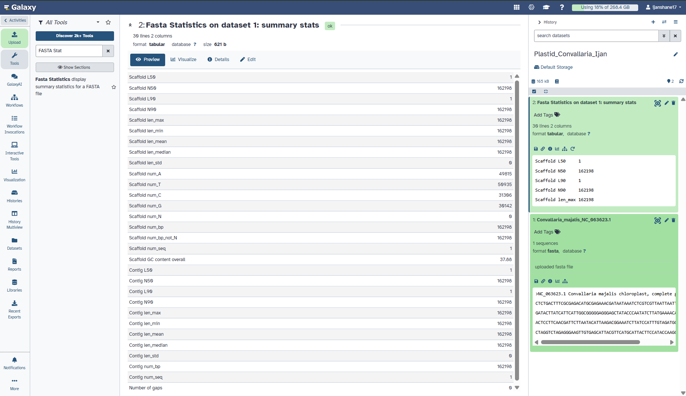

# Figures

This folder contains screenshots and figures generated during the plastid genome analysis of *Convallaria majalis*.

---

### Galaxy FASTA Statistics Result

**Figure 1.** Galaxy FASTA Statistics output for the complete chloroplast genome of *Convallaria majalis*. 

The screenshot shows the Galaxy history `Plastid_Convallaria_Ijan`, the uploaded FASTA dataset, and the successful statistics output. The analysis reported a genome length of **162,198 bp**, **1 sequence record**, **37.88% GC content**, and **0 gaps**.
